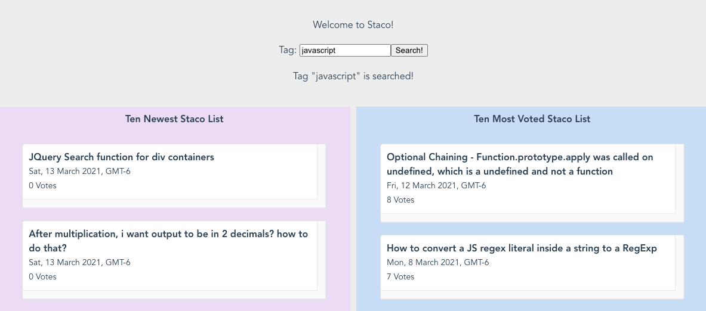

# staco

Staco is a dashboard allowing users to search for the newest & the most voted questions during the past week based on tag names. If users get interested in any of the question title displayed, they can see more details of it by simply clicking the question prompt. Then the prompt will expand and display the question body, the question comments, the answers, and all comments associated to each answer.

### Technologies
- Vue 3
- Stackoverflow API

### Docker

- Dockerize this project into Docker Hub:
  1. **Login**: `docker login`
  2. **Build**: `docker build -t <your_hub_username>/<image_name> .`
  3. **Push**: `docker push <your_hub_username>/<image_name>`

- Run this project via existing Docker image from Docker Hub:
  1. **Pull**: `docker pull jcsnorlax97/staco`
  2. **Run**: `docker run -it -p 8080:80 --rm --name staco jcsnorlax97/staco`

### Local Development

- Run locally
  1. **Clone**: `git clone <repo_git>`
  2. **Installation**: `npm install` 
  3. **Run**: `npm run server`

- Note: Vue GUI via `vue ui` can do the same job as well.

### Things I Learnt 

1. **Essentials of Vue.JS**: Components, Event Handling, List Rendering, and more
2. **Docker**: Building Docker image for the project & push into Docker Hub.
3. **Repository Pattern**: Abstracting data access, i.e. making HTTP requests to Stackoverflow, using Repository Pattern  
4. **Axios**: Making multiple HTTP requests with use of the HTTP client Axios.
